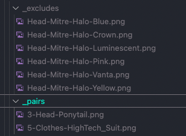

# Artwork Spec for Generation + Sharing

For this script to correclty generate your art we will need your designers to follow a very specific file/folder convention so that it works with the generation tool.

## Example: Valid Structure

## The Rules

- No spaces or special characters in any folder or file name. Only alpha numeric with `-` to seperate values and `_` to act as a space. Capitals are okay.
- Layers are seperated by folders and the folder names should be prefixed with order values, ie: `1-` will be placed on the canvas before `2-`.
- Files within a layer/folder should be prefixed with their weight value `25.0-` means there is a 25% chance that trait will be selected during random generation. All values within a layer/folder should add up to 100.
- Weight values should not contain leading zeros ie: `02.5` is not valid but `2.5` is valid.

## Special Folders

These special folders are usually not needed so unless you know you need them you can just ignore this section.

\_pairs, \_exclude, \_includes allows you to creating special conditions for layers.

For \_pairs if there is an attribute that when applied needs another image to show up on a different layer you can specify that with: OtherLayerIndex-PairCategory-PairValue.

For \_excludes if you do not want one attribute to show up with another because they conflict then you can use this format: CategoryA-ValueA-CategoryB-ValueB.png. The actual content of this file doesn’t matter the script just uses the name of the file to determine what to do. I like to copy the conflicting image into this folder and rename it just as a visual reference.

For \_includes if you only want certain traits to show up when an early trait has been selected you can use this format CategoryA-ValueA-CategoryB-ValueB.png. (still needs to be implemented)

## Sharing

These collections are very large and so we're forced to use Dropbox to share them with both teams.

We'll use some conventions here as well to avoid any mixups or mistakes.

The assets will always be:

- Zipped to reduce size and make sharing easier.
- Have a version number attached to the end of the filename ie: "collection-name-source-artifacts-v1.zip".
- Contain no uppercase letters, spaces, or special characters alpha-numeric only with `-` reserved for seperation.
- We will always upload to the same shared Dropbox folder and never send the collection out of band.

Raw layers naming convetion:

- collection-name-source-artifacts-v1.zip
- collection-name-source-artifacts-v2.zip

Presale collection naming convetion: (when there's a presale, which is not recommended)

- collection-name-presale-nft-assets-v1.zip
- collection-name-presale-nft-assets-v2.zip

Public sale collection naming convetion:

- collection-name-pubsale-nft-assets-v1.zip
- collection-name-pubsale-nft-assets-v2.zip
