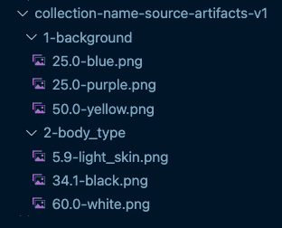

# Artwork Spec

For this script to correclty generate your art we will need your designers to follow a very specific file/folder convention so that it works with the generation tool.

## Valid Structure Example

## The Rules

- No spaces or special characters in any folder or file name. Only alpha numeric with `-` to seperate values and `_` to act as a space. Capitals are okay.
- Layers are seperated by folders and the folder names should be prefixed with order values, ie: `1-` will be placed on the canvas before `2-`.
- Files within a folder should be prefixed with their weight value `25.0-` means there is a 25% chance that trait will be selected during random generation. All values within a folder should add up to 100.
- Weight values should not contain leading zeros ie: `02.5` is not valid but `2.5` is valid.

## Special Cases

These special cases are usually not needed so unless you know you need them you can just ignore this section.

`\_pairs`, `\_conflicts.csv` allows you to creating special conditions for layers.

For `\_pairs` if there is an attribute that when applied needs another image to show up on a different layer you can specify that with: OtherLayerIndex-PairCategory-PairValue. The image in this folder should be the image that needs to be paired.

For `\_conflicts.csv`s if you do not want one attribute to show up with another because they conflict then you can use this format: "CategoryA,ValueA,CategoryB,ValueB" each of these conflicts should go on a newline in a csv file called "\_conflicts".csv"
